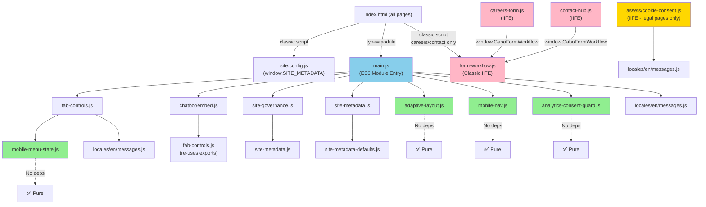

# Dependency Visualization

## Complete Module Dependency Graph



## Layered Dependency Architecture

```
┌─────────────────────────────────────────────────────────────┐
│                    APPLICATION LAYER                        │
│  main.js (ES6 Module) - Orchestrates all initialization     │
└─────────────────────────────────────────────────────────────┘
         ↓                                                  ↓
    ┌────────────────────────────────┐  ┌──────────────────────┐
    │    INTEGRATION LAYER            │  │  CONFIGURATION LAYER │
    │  (Composed Modules)             │  │  (Setup & Metadata)  │
    ├────────────────────────────────┤  ├──────────────────────┤
    │ • fab-controls.js              │  │ • site.config.js     │
    │ • chatbot/embed.js             │  │ • site-metadata.js   │
    │ • mobile-nav.js                │  │ • site-governance.js │
    │ • adaptive-layout.js           │  └──────────────────────┘
    │ • analytics-consent-guard.js   │           ↓
    └────────────────────────────────┘  ┌──────────────────────┐
         ↓                              │   DEFAULTS LAYER     │
    ┌────────────────────────────────┤  • site-metadata-     │
    │    UTILITY LAYER               │    defaults.js       │
    │  (No Dependencies)             └──────────────────────┘
    ├────────────────────────────────┤
    │ • mobile-menu-state.js         │  ┌──────────────────────┐
    │ • adaptive-layout.js (pure)    │  │  LOCALIZATION LAYER  │
    │ • analytics guard (pure)       │  ├──────────────────────┤
    │ • mobile-nav (pure) [mostly]   │  │ • locales/en/msgs.js │
    │                                │  │ • locales/es/msgs.js │
    └────────────────────────────────┘  └──────────────────────┘

┌─────────────────────────────────────────────────────────────┐
│              FORM SUBSYSTEM (Non-ES6 Classic)               │
│  form-workflow.js (IIFE) → window.GaboFormWorkflow          │
│  └─ careers/careers-form.js (depends on global)            │
│  └─ contact/contact-hub.js (depends on global)             │
└─────────────────────────────────────────────────────────────┘

┌─────────────────────────────────────────────────────────────┐
│         OPTIONAL/CONDITIONAL MODULES (Legal Pages)          │
│  assets/cookie-consent.js (IIFE - self-contained)          │
└─────────────────────────────────────────────────────────────┘
```

## Data Flow: Chatbot Initialization

```
HTML Page Load
    ↓
index.html loads site.config.js (classic script)
    └─ window.SITE_METADATA = { ... }
    ↓
index.html loads main.js (type="module")
    ↓
DOMContentLoaded event
    ↓
[Sequential Initialization]
    ├─ initAnalyticsConsentGuard()
    │  └─ Removes/observes Cloudflare Beacon scripts
    │  └─ ISSUE: Called before DOM ready
    ├─ initSiteGovernance()
    │  └─ Reads: window.SITE_METADATA (from site.config.js)
    │  └─ via: getSiteMetadata() from site-metadata.js
    │  └─ Syncs SEO/security config
    ├─ initAdaptiveLayout()
    │  └─ Sets CSS viewport tokens
    │  └─ Listens: resize, orientationchange
    ├─ initMobileNav()
    │  └─ Creates: #mobile-nav-root with navigation
    │  └─ Listens: services toggle, breakpoint
    ├─ initFabControls() ← KEY FOR CHATBOT
    │  └─ Creates: #fabWrapper with FAB button + mount point
    │  └─ #fabWrapper
    │     ├─ #fabMainToggle (hamburger menu)
    │     ├─ #fabOverlay (menu panel)
    │     └─ #fabChatMount (hidden mount point for chatbot)
    │  └─ Listeners: toggle, dismiss, escape, breakpoint
    ├─ initGaboChatbotEmbed() ← CHATBOT INITIALIZATION
    │  ├─ Loads chat state from localStorage (gabo_io_chatbot_cache_v1)
    │  ├─ Creates: <section class="gabo-chatbot">
    │  │  └─ <div id="gaboChatbotPanel">
    │  │     ├─ <header>Gabo io</header>
    │  │     ├─ <div class="gabo-chatbot__log"></div>
    │  │     └─ <form>
    │  │        ├─ <input type="text" />
    │  │        └─ <button type="submit">Send</button>
    │  │
    │  ├─ Mount priority:
    │  │  1. #fabChatMount (preferred - inside FAB)
    │  │  2. #fabWrapper (fallback - attach to FAB wrapper)
    │  │  3. document.body (last resort)
    │  │
    │  ├─ Listeners wired:
    │  │  ├─ #fabChatTrigger.click → togglePanel()
    │  │  ├─ gabo:chatbot-open event → setOpen(true)
    │  │  ├─ panel.click outside → closePanel()
    │  │  ├─ Escape key → closePanel()
    │  │  └─ Form submit → streamResponse()
    │  │
    │  └─ Integration:
    │     └─ Calls fab-controls.js:setDesktopFabOpenState(false)
    │        to close menu when chat opens
    │
    ├─ initFormStatus()
    │  └─ Adds "Submitting..." to all forms
    │
    └─ initHomeHeroFlipCard() & initCenterServicesRotation()
       └─ Animation controllers

    ↓
User clicks #fabChatTrigger (in FAB menu)
    ↓
chatbot/embed.js: setOpen(true)
    ├─ fab-controls.js: setDesktopFabOpenState(false) [close menu]
    ├─ Dispatch: gabo:fabs-close [close other FABs]
    ├─ Show: #gaboChatbotPanel
    ├─ Set: aria-expanded=true
    ├─ Add: class="chat-open" to body
    └─ Focus: input.focus()

User types message + enters
    ↓
chatbot/embed.js: form submit listener
    ├─ Get: input.value.trim()
    ├─ Add to history: { role: 'user', content: message }
    ├─ Clear input
    ├─ Disable send button
    ├─ Fetch POST to con-artist.rulathemtodos.workers.dev/api/chat
    │  ├─ Headers: x-gabo-parent-origin, x-ops-asset-id
    │  ├─ Body: { mode, messages, meta }
    │  └─ Response: Server-Sent Events (streaming)
    ├─ Stream response into history[assistantIndex]
    ├─ Render to log: renderLog()
    ├─ Save to localStorage
    └─ Re-enable send button

User clicks elsewhere or presses Escape
    ↓
chatbot/embed.js: setOpen(false)
    ├─ Hide: #gaboChatbotPanel
    ├─ Dispatch: gabo:chatbot-close
    └─ Remove: class="chat-open" from body
```

## Issue Hotspots Diagram

```
🔴 CRITICAL BUGS (Must Fix)
┃
├─ chatbot/embed.js @ line 201
│  └─ undefined variable: overlay
│     └─ IMPACT: overlay click won't close chat
│
├─ main.js @ top level
│  └─ analytics guard called before DOM ready
│     └─ IMPACT: MutationObserver may not start properly
│
└─ chatbot/embed.js @ fetch call
   └─ no timeout set
      └─ IMPACT: chat hangs if worker down

🟨 HIGH PRIORITY (Soon)
┃
├─ form-workflow.js
│  └─ global window.GaboFormWorkflow
│     └─ IMPACT: script order dependency, not modular
│
├─ site-metadata.js
│  └─ ACTIVE_LOCALE hardcoded to 'en'
│     └─ IMPACT: Spanish locale unused
│
└─ careers-form.js, contact-hub.js
   └─ no error checking for window.GaboFormWorkflow
      └─ IMPACT: silent failure if form-workflow.js fails

🟧 MEDIUM PRIORITY (Next Sprint)
┃
├─ mobile-nav.js
│  └─ creates root without deduplication
│     └─ IMPACT: multiple invocations create dupes
│
├─ fab-controls.js
│  └─ ensureDesktopFabNav() not fully idempotent
│     └─ IMPACT: duplicate creation possible
│
└─ site-governance.js
   └─ audit checks incomplete
      └─ IMPACT: not all checks executed

🟦 LOW PRIORITY (Nice to Have)
┃
├─ main.js
│  └─ unused EN_MESSAGES import
│     └─ IMPACT: code cleanliness
│
└─ duplicate breakpoints
   └─ IMPACT: inconsistency if changed
```

## Module Quality Scorecard

```
┌────────────────────────────────────────────────────────┐
│  Module                   │ Grade │ Issues │ Deps     │
├────────────────────────────────────────────────────────┤
│  adaptive-layout.js       │  A    │  0     │  Pure ✓  │
│  mobile-menu-state.js     │  A    │  0     │  Pure ✓  │
│  analytics-consent-guard  │  A    │  1*    │  Pure ✓  │
│  site-metadata-defaults   │  A    │  0     │  Pure ✓  │
│  mobile-nav.js            │  A-   │  1     │  Pure ~  │
│  site-metadata.js         │  A    │  1     │  1 mod   │
│  site-governance.js       │  A    │  1     │  1 mod   │
│  fab-controls.js          │  A-   │  1     │  2 mods  │
│  main.js                  │  A-   │  2     │  8 mods  │
│  chatbot/embed.js         │  B+   │  3     │  1 mod   │
│  form-workflow.js         │  C+   │  3     │  Global  │
│  careers-form.js          │  C    │  2     │  Global  │
│  contact-hub.js           │  C    │  2     │  Global  │
│  cookie-consent.js        │  B    │  1     │  1 mod   │
│                                                         │
│  (* = timing issue, ~ = mostly)                        │
│  Color Legend:                                         │
│  🟢 A range = Production Ready                        │
│  🟡 B range = Minor Issues                            │
│  🔴 C range = Needs Refactoring                       │
└────────────────────────────────────────────────────────┘
```

## Data Dependency Flow: Metadata

```
site.config.js
│
│ window.SITE_METADATA = {
│   name: { en: 'Gabriel Services' },
│   description: { ... },
│   seo: { ... },
│   security: { ... },
│   media: { ... }
│ }
│
└─→ site-metadata.js
    │
    ├─ Reads: window.SITE_METADATA
    ├─ Merges with: SITE_METADATA_DEFAULTS
    ├─ Provides function:
    │  ├─ getSiteMetadata()
    │  ├─ getFrozenSiteMetadata()
    │  └─ getLocalizedValue()
    │
    └─→ Consumed by:
        ├─ main.js
        │  └─ syncPageMetadata()
        │     └─ Updates: document.title, meta[name=description]
        │
        ├─ site-governance.js
        │  └─ syncSeoTags()
        │     └─ Updates: og:*, twitter:* meta tags
        │
        └─ Any future code needing config
```

## Event Flow Diagram: Chatbot Lifecycle

```
Window Load
    ↓
[SETUP PHASE]
initFabControls()
    ├─ Creates FAB structure
    ├─ Mount point: #fabChatMount
    └─ Wires FAB toggle button

initGaboChatbotEmbed()
    ├─ Creates chatbot DOM
    ├─ Mounts to #fabChatMount
    ├─ Loads history from localStorage
    └─ Wires all event listeners

[INTERACTION PHASE]
User opens FAB menu
    ↓
clicks #fabMainToggle
    ↓
dispatches: gabo:fabs-close  [closes other FABs]
    ↓
User sees chat button → clicks #fabChatTrigger
    ↓
chatbot:setOpen(true)
    ├─ Dispatches: gabo:fabs-close [redundant]
    ├─ Shows: #gaboChatbotPanel [hidden → visible]
    ├─ Sets: aria-expanded=true
    ├─ Adds class: chat-open [to body]
    ├─ Renders: chat history
    └─ Focuses: input

User types message
    ↓
Form submit
    ├─ pushMessage('user', text)
    ├─ fetch to worker (streaming)
    ├─ pushMessage('assistant', response)
    ├─ renderLog()
    └─ saveState() [localStorage]

[CLEANUP PHASE]
User closes chat (Escape key or click outside)
    ↓
closeChat()
    ├─ setOpen(false)
    │  └─ Hides: #gaboChatbotPanel
    ├─ Dispatches: gabo:chatbot-close
    └─ Removes class: chat-open

Browser unload
    ↓
State persisted in localStorage (gabo_io_chatbot_cache_v1)
    ↓
Next page load: state restored from localStorage ✓
```

## Critical Path Analysis

**Fastest Route to Chatbot Working:**
1. ✓ site.config.js loads (defines window.SITE_METADATA)
2. ✓ main.js loads (entry point)
3. ✓ fab-controls.js loads (creates FAB structure & mount point)
4. ✓ chatbot/embed.js loads (creates chatbot DOM)
5. ✓ DOMContentLoaded fires
6. ✓ initFabControls() runs (wires FAB)
7. ✓ initGaboChatbotEmbed() runs (wires chatbot)
8. → **Chatbot ready to use**

**Break Points (If Missing):**
- ❌ site.config.js missing → SITE_METADATA undefined (graceful fallback: empty)
- ❌ main.js missing → No initialization
- ❌ fab-controls.js missing → No #fabWrapper, chat mounts to body (suboptimal)
- ❌ chatbot/embed.js missing → No chat functionality
- ❌ DOMContentLoaded never fires → Initialization stalled

**Performance Bottleneck:**
- First chat message fetch to worker (30-100ms typical)
- No caching of worker responses
- No batching of messages
